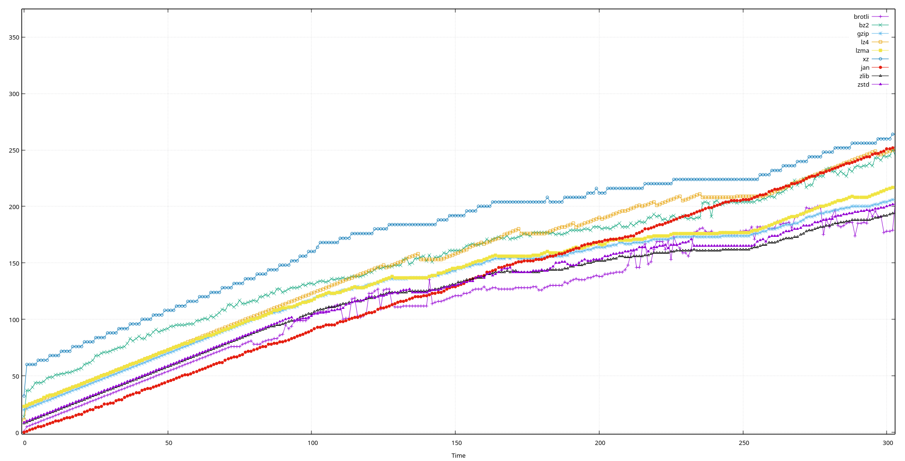

# splaycompress

This is a simple compression utility, with two purposes:

- It serves as a proof-of-concept, to demonstrate that Splay Trees (invented by [Robert Tarjan](https://en.wikipedia.org/wiki/Robert_Tarjan)) can be used to compress data reasonably well.
- It can be used as a file compression method, for which I hereby define the `.jan` file extension. If you compress a tarball this way, it would have the [`.tar.jan`](https://en.wikipedia.org/wiki/Robert_Tarjan) file extension.

I originally invented all of this as a joke: "It's a `.tar.jan` that uses a `Tarjan`-datastructure, hehe :-)"

However, this compression scheme is actually surprisingly good for short snippets of data, often beating zstd, lz4, and others.

For example, running on the input `However, this compression scheme is actually surprisingly good for short snippets of data, often beating zstd, lz4, and others.\n`, we get the following results:

| Program       | Bytes |
| ------------- | ----- |
| p7zip         | 214   |
| lzop          | 182   |
| xz            | 180   |
| lz4           | 147   |
| bzip2         | 136   |
| lzma          | 135   |
| (none)        | 128   |
| gzip          | 121   |
| zstd          | 114   |
| zlib          | 109   |
| splaycompress | 103   |
| brotli-rs     | 87    |

Using `-9` and/or `-f` does not seem to change these numbers.

splaycompress beats most other compression methods easily, and not just by omitting filemagic/metadata, or using a hardcoded magical dictionary!

## Table of Contents

- [Install](#install)
- [Usage](#usage)
- [Background](#background)
- [TODOs](#todos)
- [NOTDOs](#notdos)
- [Contribute](#contribute)

## Install

This software isn't ready yet for widespread use. However, it's less than 1000 lines of code, it's MIT licensed, so you could just copy it and install it with `cargo`.

I might make it available through crates.io if there is any demand.

## Usage

The library itself provides two functions, `compress` and `decompress`, each of which takes an input implementing `Read` and an output implementing `Write`. They both read the input, (de)compress it, and write the result to the output.

### `jan`, the CLI tool

Currently, the program is extremely simple and stupid:

- With no CLI-arguments, it compresses data from stdin to stdout, stopping only when EOF is reached, then flushing the rest to stdout.
- With the `-d` CLI-argument, it *DE*compresses data from stdin to stdout, stopping only when EOF is reached, then flushing the rest to stdout.
- `clap` provides `-h`/`--help` and `-V`/`--version` commands by default

Examples:

```console
$ echo "This is a simple example" | cargo run -q | hd
00000000  54 a8 8c 60 41 3c 1a c5  6d a5 c0 c5 a3 87 fc 05  |T..`A<..m.......|
00000010  ad a8 74 c2 a2                                    |..t..|
00000015
$ echo "This is a simple example" | cargo run -q | cargo run -q -- -d | hd
00000000  54 68 69 73 20 69 73 20  61 20 73 69 6d 70 6c 65  |This is a simple|
00000010  20 65 78 61 6d 70 6c 65  0a                       | example.|
00000019
```

Since _all_ data is a valid bitstream, you can even "decompress" arbitrary data, for fun and (probably) no profit:

```console
$ echo "Decompressing this probably won't make much sense." | cargo run -q -- -d | hd
00000000  44 44 2b 0d 1e 2a 27 07  04 04 04 04 02 05 26 05  |DD+..*'.......&.|
00000010  04 04 05 23 23 26 26 27  28 23 28 29 28 28 29 25  |...##&&'(#()(()%|
00000020  1f 22 06 02 07 06 02 02  02 19 05 00 03 00 02 02  |."..............|
00000030  04 03 05 07 00 18 18 21  24 23 23 22 20 21 22 23  |.......!$##" !"#|
00000040  21 00 23 21 23 21 1f 20  24 29 29 25 26 24 26 24  |!.#!#!. $))%&$&$|
00000050  27 28 29 2e 44 45 45 27  2a 3b 33 36 39 38 35 35  |'().DEE'*;369855|
00000060  33                                                |3|
00000061
```

## Background

### The joke

Everyone knows, the best way to fully appreciate a joke is to explain it in excruciating detail, because explaining a joke makes it even better. That's why the following paragraph explains the joke in way too much detail.

On unix-like systems, it is common practice to transfer and move around collections of file as "tarballs". These might be `foo.tar.gz`, or `photos.tar.bz2` or perhaps even `tar_1.34+dfsg.orig.tar.xz`. I don't remember when, but at some point in life I noticed that the name "Tarjan" starts with the letters "tar", and googled whether there is something that could produce a `filename.tar.jan`, and whether it's related to Tarjan somehow.

There wasn't.

My heart was broken, and my soul yearned to fill this hole in the world, which needs a pun now more than ever in the history of jokes.

Over the course of several years, I tried out various way to make it work. But how would [strongly connected components](https://en.wikipedia.org/wiki/Tarjan%27s_strongly_connected_components_algorithm) do any compression? The [median of medians](https://en.wikipedia.org/wiki/Median_of_medians) algorithm trips up many Computer Science students, and _feels_ vaguely related to compression due to its surprisingly-linear runtime, but I don't see how to make it work. I love the seeming simplicity of [Union-Find](https://en.wikipedia.org/wiki/Disjoint-set_data_structure), but the monotonocity of the data structure doesn't seem to be compatible with the concept of continuous compression operations at all. In fact, I got stuck trying to think of general graph-based algorithms for way too long.

But Splay Trees are the _obvious_ and, in hindsight, even _extremely_ obvious candidate: Invented by him, and directly relates the concept of "data" to "short representation". Bingo!

That allows me to define some compression algorithm and assign the file extension `.jan` to it.

If you compress a tarball this way, it would have the [`.tar.jan`](https://en.wikipedia.org/wiki/Robert_Tarjan) file extension.

It's a `.tar.jan` that uses a `Tarjan`-datastructure, hehe :-)

### How it works

The compression algorithm is embarrassingly trivial:

- Initialize a Splay Tree with elements 0 through 255 as leaves on the eighth level, which necessitates 255 internal nodes.
- When compressing, just look up each byte of the input in order. Emit each left/right decision as a 0 or 1 bit. (Pad the final byte in a way such that no symbol is produced, which is always possible. Proving this is a nice finger exercise.)
- When *DE*compressing, simply follow the left/right decisions from the input, and remember to splay the tree after ever output symbol.

Note that this approach might waste a few bits in the end, which is unavoidable.

### Why it works

Splay Trees satisfy a surprising variety of optimality theorems, and they are conjectured to behave asymptotically-optimal in some sense.

In particular, the [Static Optimality Theorem](https://en.wikipedia.org/wiki/Splay_tree#Performance_theorems) can be rephrased as: The number of pointer dereferences (number of steps going left/right in the tree) during a sequence of element accesses is, in some sense, very close to optimal in terms of symbol entropy.

This means that for inputs from one of the many classes of sequences for which Splay Trees have been proven to perform exceptionally-well, the above algorithm will emit very few bits, which is exactly what we commonly refer to as "compression".

This means that the compression works exceptionally well for (at least) the following kinds of behaviors, without even attempting to recognize or special-case these patterns:

- Repeated bytes (not just zeros or 0xFF!)
- High-entropy bytes from a reasonably-narrow range (even across power-of-two boundaries! This includes ASCII text!)
- Scan-like sequences, as is often found in indices.
- Arbitrary interleavings of the above, even with random data strewn in, as long as the ratio of compressible data is high enough.

Most importantly, this compresses short blobs of data unusually well, without falling back to tricks like using a large hardcoded dictionary like brotli.

### Why it doesn't work

1. Because it can never go below 1 bit per byte, i.e. 12.5%, and even that would require incredible amounts of repetition. Here's a comparison how various compression algorithms behave for prefixes of the `src/splay.rs` file as of this commit. Even zooming in on the most advantageous part of this graph, one can clearly see that splaycompress has a steeper increase in filesize than the other algorithms.
   
2. Because it requires incredibly sequential computations and pointer-chasing. My implementation is deliberately local, keeping most of the memory in just a few places. Nevertheless, the way one byte is interpreted completely changes the way the next byte is interpreted, meaning that the throughput is limited by the CPU, with lots of cycles per _bit_.

Both of these points could be _slightly_ improved by using 16-bit words as the basis for everything, but the heightened memory consumption makes this questionable again.

This approach won't conquer the world, I know. But still, it's much better than I thought.

## TODOs

- Publish it somewhere, see what friends and people think
- Maybe make it a real library on crates.io
- Compare with other compression schemes.
- Try to do some performance improvements – however, compressing random data already runs at around 9 MiB/s, and compressing all-zeros runs at around 91 MiB/s on my machine. I don't really see the point of optimizing this even further.

If anyone wants to standardize this, I would like to suggest the filemagic for "raw splaycompress data, no metadata except this filemagic" to be `\xb3\xa9\x14\x00\xb9\x6c\x0d\xd8`. (These are 6 random bytes, the NUL byte, and the '\\r' byte, which I re-shuffled until neither of the two injected bytes are at either end. This should provide a good balance between global uniqueness and build-in error detection. )

## Contribute

Feel free to dive in! [Open an issue](https://github.com/BenWiederhake/splaycompress/issues/new) or submit PRs.
